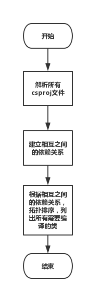

# Transfer
该项目主要是来源于携程的Hackathon的项目

[](https://travis-ci.org/ec-league/Transfer)
[](https://codecov.io/gh/ec-league/Transfer)

## Context

提升.NET转Java的研发效率

本项目主要是为了将C#代码自动转成对应的Java代码

主要包括以下几个方面

1. `var`关键字的处理，Java中不支持`var`关键字的，需要自动识别对应的新建对象的类型
2. 静态类的处理，将其自动转成`Spring Bean`
3. 对应`out`,`ref`,`this`等关键字的处理

## Solution

项目包括几个方面：

* `*.csproj`文件的解析，C#和Java的不同在于，在对类的加载上，需要解析`*.csproj`文件来解析对应的`*.cs`文件
* 目前C#代码中的任务并非通过`main()`函数启动，而是通过容器启动，所需需要对于`*.csproj`文件中的项目依赖进行解析
* 对于静态类，可以自动生成`Spring Bean`，自动抽象接口

### Csproj文件的解析

.Net项目与项目之间的依赖主要是通过`csproj`文件来进行管理的，其本身为一个`XML`格式的配置文件。其中包含了对于其他项目的引用，以及自身编译代码，编译环境等的一些配置。如下：

```XML
<?xml version="1.0" encoding="utf-8"?>
<Project ToolsVersion="4.0" DefaultTargets="Build" xmlns="http://schemas.microsoft.com/developer/msbuild/2003">
  <Import Project="$(MSBuildExtensionsPath)\$(MSBuildToolsVersion)\Microsoft.Common.props" Condition="Exists('$(MSBuildExtensionsPath)\$(MSBuildToolsVersion)\Microsoft.Common.props')" />
  <PropertyGroup>
    <ProjectGuid>{57AE68FC-709A-4AF6-B0C1-944516BE128D}</ProjectGuid>
    <ProjectTypeGuids>{349c5851-65df-11da-9384-00065b846f21};{fae04ec0-301f-11d3-bf4b-00c04f79efbc}</ProjectTypeGuids>
  </PropertyGroup>
  <ItemGroup>
    <Reference Include="Arch.CFX">
      <HintPath>..\..\Common\Lib\Framework\Release\Arch.CFX.dll</HintPath>
    </Reference>
  </ItemGroup>
  <ItemGroup>
    <Compile Include="IntlCacheOperationService.cs" />
  </ItemGroup>
  <ItemGroup>
    <ProjectReference Include="..\BussinessLayer\SearchService\SearchService.csproj">
      <Project>{d50ab7cb-6965-4df7-91f2-e62c985582d1}</Project>
      <Name>SearchService</Name>
    </ProjectReference>
  </ItemGroup>
  <ItemGroup>
    <Content Include="web.config" />
  </ItemGroup>
  <PropertyGroup>
    <VisualStudioVersion Condition="'$(VisualStudioVersion)' == ''">10.0</VisualStudioVersion>
    <VSToolsPath Condition="'$(VSToolsPath)' == ''">$(MSBuildExtensionsPath32)\Microsoft\VisualStudio\v$(VisualStudioVersion)</VSToolsPath>
  </PropertyGroup>
  <Import Project="$(MSBuildBinPath)\Microsoft.CSharp.targets" />
  <Import Project="$(VSToolsPath)\WebApplications\Microsoft.WebApplication.targets" Condition="'$(VSToolsPath)' != ''" />
  <Import Project="$(MSBuildExtensionsPath32)\Microsoft\VisualStudio\v10.0\WebApplications\Microsoft.WebApplication.targets" Condition="false" /> 
</Project>

```
如上可以发现，其中包含了编译文件的信息，包含了对其他项目的引用的信息。这些都是`csproj`解析所需要解析出来的。基本流程如下：



代码中，`com.ecleague.parser.CsprojParser`将会读取一个目录，遍历目录下的所有的`csproj`文件，来生成对应的`CsConfiguration`实体。

